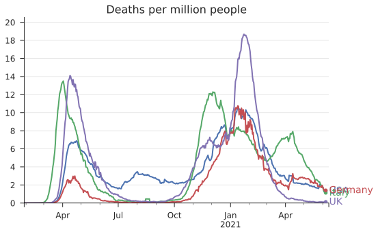

# CoViz

Plotting tools for COVID-19

## Data

This uses comprehensive and continually updated data from the European Centre for Disease Prevention and Control (ECDC) for country level data. You can download that yourself here: https://www.ecdc.europa.eu/en/geographical-distribution-2019-ncov-cases

The state and county level data comes from the New York Times GitHub repository (https://github.com/nytimes/covid-19-data), which is included as a submodule in this repository. To fetch that run:

``
git submodule init
git submodule update
``

To update these again at a later date, I usually just run:

``
git submodule foreach git pull origin master
``

## Code

The files `data_tools.py` and `plot_tools.py` provide the underlying functionality, and the main interface is through `visualize.ipynb`.
